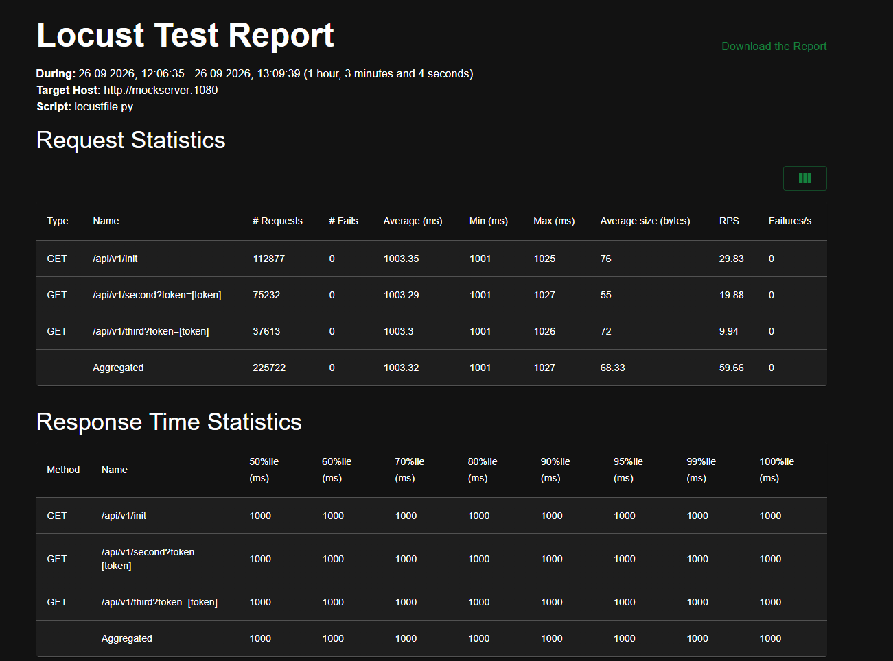
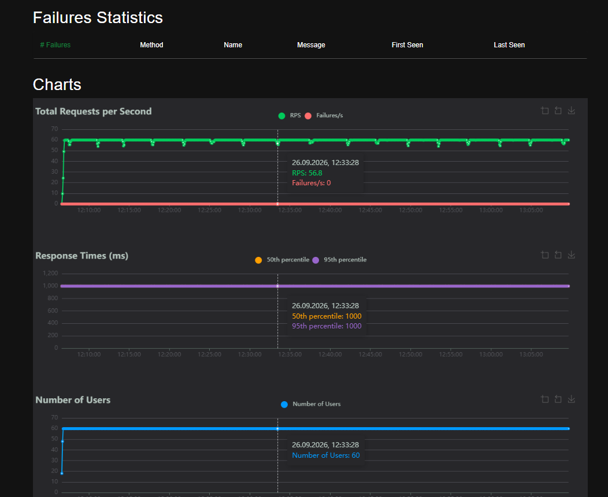
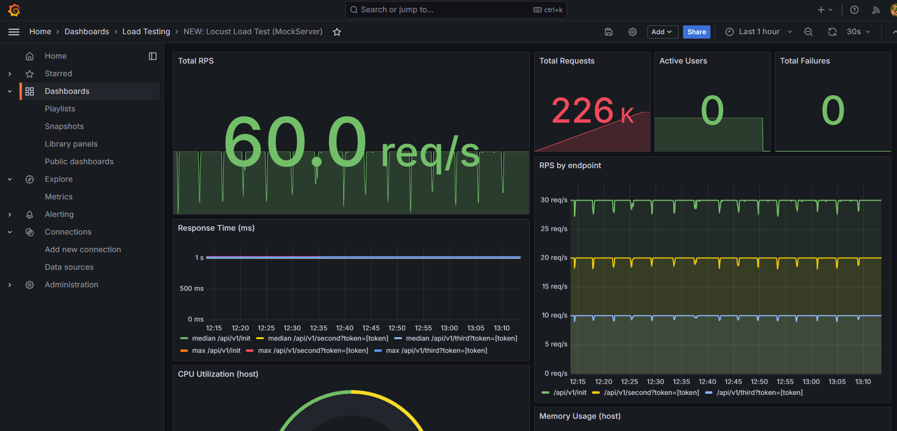
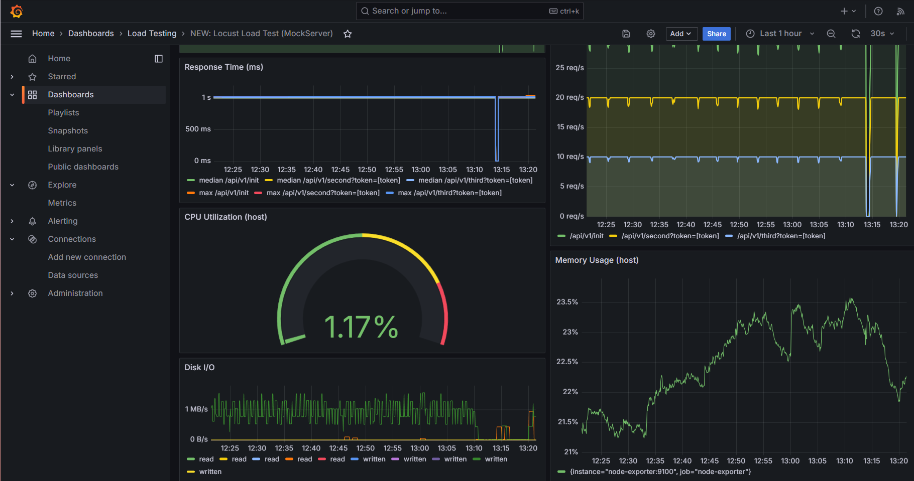
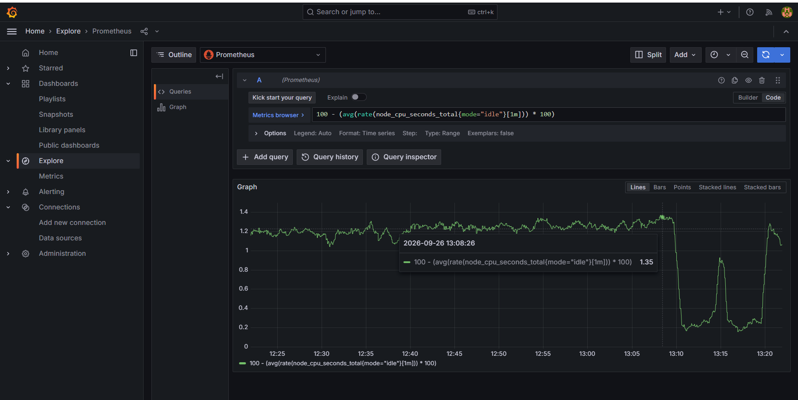
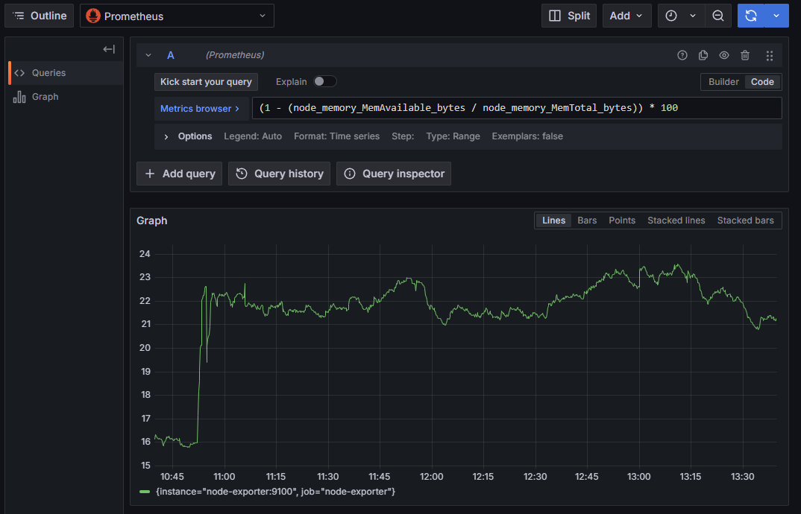
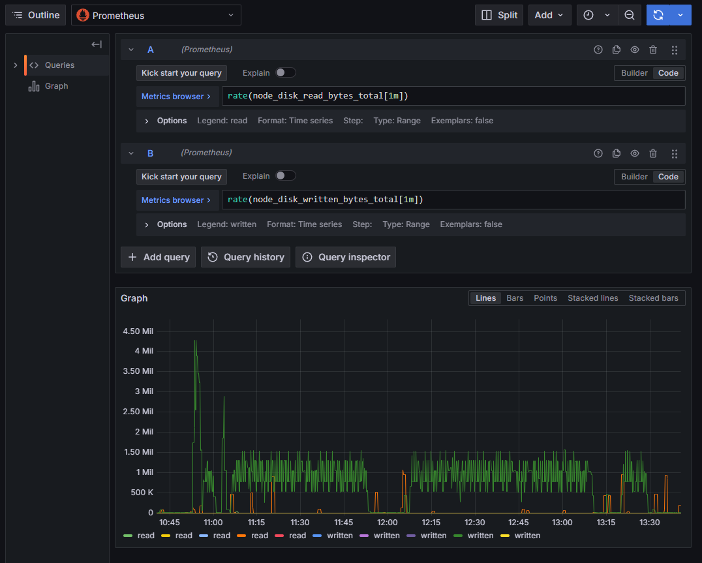

# QA Load Testing Stack: MockServer + Locust + Prometheus + Grafana

Полностью контейнеризированный стенд для нагрузочного тестирования mock-API
с мониторингом в реальном времени.

[](https://docs.docker.com/compose/)
[](https://locust.io/)
[](https://prometheus.io/)
[](https://grafana.com/)
[](https://opensource.org/licenses/MIT)

---

## 📋 О проекте

Стенд воспроизводит тестовое задание QA-стажёра:

- **Mock API** с тремя endpoint'ами и задержкой ответа 1 секунда.
- **Корреляция токена**: значение, полученное от `/init`, передаётся в `/second` и `/third`.
- **Профиль нагрузки 30 / 20 / 10 RPS** на соответствующие endpoint'ы.
- **Тест длительностью 1 час** с непрерывным снятием метрик.
- **Мониторинг**: время ответа, процент ошибок, CPU / Memory / Disk I/O.

Всё запускается одной командой `docker compose up -d` и полностью воспроизводимо
на любой машине с Docker.

---

## Архитектура

```
                   ┌──────────────────────┐
                   │      Locust          │
                   │  InitUser   (30 RPS) │
                   │  SecondUser (20 RPS) │
                   │  ThirdUser  (10 RPS) │
                   └──────────┬───────────┘
                              │ HTTP
                              ▼
                   ┌──────────────────────┐
                   │     MockServer       │
                   │  /api/v1/init        │
                   │  /api/v1/second      │
                   │  /api/v1/third       │
                   └──────────┬───────────┘
                              │ metrics (pull)
                              ▼
   ┌────────────────┐   ┌─────────────┐   ┌──────────────┐
   │ locust-exporter│──▶│ Prometheus  │◀──│ node-exporter│
   │   :9646        │   │   :9090     │   │    :9100     │
   └────────────────┘   └──────┬──────┘   └──────────────┘
                               │            ▲
                               │            │ container metrics
                               │       ┌────┴─────┐
                               ▼       │ cAdvisor │
                        ┌────────────┐ │  :8080   │
                        │  Grafana   │ └──────────┘
                        │   :3000    │
                        └────────────┘
```

---

## Стек

| Компонент          | Назначение                                                |
|--------------------|-----------------------------------------------------------|
| **MockServer** 5.15 | Mock API с 3 endpoint'ами, задержка 1 с, корреляция токена |
| **Locust** 2.32.4 | Нагрузочный инструмент, профиль 30/20/10 RPS              |
| **locust-exporter**| Экспорт метрик Locust в формате Prometheus                |
| **Prometheus** 2.54 | Сбор и хранение метрик                                    |
| **Grafana** 11.2 | Визуализация, dashboards, provisioning из JSON            |
| **node-exporter** 1.8 | Метрики хоста: CPU, memory, disk I/O                  |
| **cAdvisor** 0.49 | Метрики контейнеров (с ограничениями в Docker Desktop)   |

---

## Быстрый старт

### Требования

- Docker Desktop 4.20+ (или Docker Engine + Docker Compose v2)
- 4 GB RAM, 2 CPU
- Свободные порты: `1080`, `3000`, `8089`, `9090`, `9646`

### Запуск

```bash
git clone https://github.com/IMPULSE-LAB-CRYPTO/qa-load-testing-mockserver.git
cd qa-load-testing-mockserver
docker compose up -d
```

Через 20–30 секунд все сервисы поднимутся. Проверить статус:

```bash
docker compose ps
```

### Доступ к сервисам

| Сервис    | URL                       | Логин / пароль |
|-----------|---------------------------|----------------|
| Locust UI | http://localhost:8089     | —              |
| Grafana   | http://localhost:3000     | `admin` / `admin` |
| Prometheus| http://localhost:9090     | —              |
| cAdvisor  | http://localhost:8080     | —              |
| MockServer| http://localhost:1080     | —              |

---

## 🧪 Профиль нагрузки

| Endpoint                | RPS | Описание                                              |
|-------------------------|-----|-------------------------------------------------------|
| `/api/v1/init`          | 30  | Возвращает токен. Producer.                           |
| `/api/v1/second?token=` | 20  | Принимает токен. Consumer.                            |
| `/api/v1/third?token=`  | 10  | Принимает токен. Consumer.                            |
| **Итого**               | 60  | 60 виртуальных пользователей, ramp-up 6 users/sec.    |

**Логика корреляции:**

1. `InitUser` вызывает `/init`, извлекает токен из ответа.
2. Токен кладётся в общую очередь (`gevent.queue.Queue`).
3. `SecondUser` и `ThirdUser` берут токен из очереди и передают его в query-параметре.
4. Производитель (30 RPS) и потребители (20 + 10 RPS) сбалансированы.

В Locust это реализовано через `weight = 30 / 20 / 10` и `constant_pacing(1)`,
что даёт ровно одну итерацию в секунду на пользователя.

---

## Endpoints

Все три endpoint'а описаны в `mockserver/config/expectations.json`.

### `GET /api/v1/init`

```json
{
  "token": "token-abc-123",
  "value": 42,
  "message": "Initialized"
}
```

### `GET /api/v1/second?token=<token>`

```json
{ "status": "second-ok", "token_received": true }
```

### `GET /api/v1/third?token=<token>`

```json
{ "status": "third-ok", "token_received": true, "final": true }
```

Задержка ответа — **1 секунда** (соответствует базовому требованию ТЗ).

---

## 📁 Структура проекта

```
qa-load-testing-mockserver/
├── docker-compose.yml              # Оркестрация всех сервисов
├── .env.example                    # Переменные окружения
├── README.md
├── locust/
│   ├── Dockerfile                  # Образ Locust (baseline)
│   ├── locustfile.py               # Нагрузочный сценарий
│   └── reports/                    # CSV и HTML-отчёты
├── mockserver/
│   └── config/
│       └── expectations.json       # Описание 3 endpoint'ов
├── prometheus/
│   └── prometheus.yml              # Scrape-конфигурация
├── grafana/
│   ├── provisioning/
│   │   ├── datasources/datasource.yml   # Авто-подключение Prometheus
│   │   └── dashboards/dashboard.yml     # Авто-загрузка дашбордов
│   └── dashboards/
│       └── locust-dashboard.json   # Кастомный дашборд
├── scripts/
│   ├── run-test.sh                 # Запуск теста (Git Bash / Linux)
│   └── run-test.ps1                # Запуск теста (PowerShell)
└── results/
    └── final-1h/                   # Артефакты финального теста
```

---

## Запуск теста

### Вариант 1: через Locust UI (рекомендуется)

1. Открой **http://localhost:8089**.
2. Заполни:
   - **Number of users:** `60`
   - **Spawn rate:** `6`
   - **Host:** `http://mockserver:1080`
3. Нажми **Start swarming**.
4. Открой Grafana во второй вкладке (`http://localhost:3000`) — смотри метрики
   в реальном времени (диапазон **Last 15 minutes**, автообновление **10s**).
5. По завершении нажми **Stop**.

### Вариант 2: headless (без UI)

```bash
# Git Bash / Linux
bash scripts/run-test.sh 1h

# PowerShell
.\scripts\run-test.ps1 -Duration 1h
```

> **Важно:** headless-режим запускает отдельный процесс Locust без web-UI,
> поэтому `locust-exporter` не сможет его опросить, и метрики не попадут в Grafana.
> Для мониторинга в реальном времени используйте **Вариант 1 (UI)**.

---

## 📊 Мониторинг

### Что собирается

| Метрика                         | Источник          | Панель Grafana          |
|---------------------------------|-------------------|--------------------------|
| RPS по endpoint'ам              | locust-exporter   | RPS by endpoint          |
| Общий RPS                       | locust-exporter   | Total RPS                |
| Response time (median, max)     | locust-exporter   | Response Time (ms)       |
| Количество ошибок               | locust-exporter   | Total Failures           |
| Активные пользователи           | locust-exporter   | Active Users             |
| CPU utilization (хост)          | node-exporter     | CPU Utilization (host)   |
| Memory usage (хост)             | node-exporter     | Memory Usage (host)      |
| Disk I/O (хост)                 | node-exporter     | Disk I/O                 |

### Grafana provisioning

Дашборд и datasource настраиваются **автоматически** при старте Grafana
через файлы в `grafana/provisioning/`. Это значит:

- Никакого ручного Import.
- Воспроизводимо на чистой машине.
- Версионируется через Git.

---

## Результаты

### Smoke-прогон (5 минут)

| Метрика             | Значение |
|---------------------|----------|
| RPS `/init`         | 30       |
| RPS `/second`       | 20       |
| RPS `/third`        | 10       |
| Total RPS           | 60       |
| Ошибки              | 0%       |
| Median response     | ~1000 ms |

### Финальный прогон (1 час)

**Дата:** 26.09.2026, 12:06:35 – 13:09:39 UTC  
**Длительность:** 1 час 3 минуты  
**Профиль:** 30 / 20 / 10 RPS  
**Хост:** `http://mockserver:1080`

| Метрика                        | Значение       |
|--------------------------------|----------------|
| **Всего запросов**             | 225,722        |
| **Ошибок**                     | 0 (0.00%)      |
| **RPS `/init`**                | 29.83          |
| **RPS `/second`**              | 19.88          |
| **RPS `/third`**               | 9.94           |
| **Aggregated RPS**             | 59.66          |
| **p50 response time**          | 1000 ms        |
| **p95 response time**          | 1000 ms        |
| **p99 response time**          | 1000 ms        |
| **Max response time**          | 1027 ms        |
| **CPU utilization (host)**     | ~1.2% (max 1.35%) |
| **Memory usage (host)**        | ~22%           |
| **Disk I/O (peak)**            | ~3 MB/s        |

### Отчёт Locust





### Дашборд Grafana





### Метрики хоста

**CPU Utilization:**


**Memory Usage:**


**Disk I/O:**


### Выводы

- ✅ Все три endpoint'а держали целевой RPS на протяжении всего часа: **30 / 20 / 10** с отклонением <1%.
- ✅ **Ноль ошибок** при 225,722 запросах — корреляция токена работает корректно под нагрузкой.
- ✅ **Latency стабильная**: p50, p95 и p99 = 1000 мс (фиксированная задержка MockServer), max = 1027 мс.
- ✅ **Ресурсы хоста в норме**: CPU ~1.2%, RAM ~22%, Disk I/O без пиков.
- ✅ Stack выдержал нагрузку без деградации — графики ровные, деградации RPS или роста времени ответа не наблюдается.

Полный HTML-отчёт: [`results/final-1hour/report.html`](results/final-1hour/report.html)  
CSV с сырыми данными: [`results/final-1hour/request.csv`](results/final-1hour/request.csv)

---

## Известные ограничения

### Random delay 0.5–1.5 сек не реализован

ТЗ содержит опциональное пожелание — сделать случайную задержку 0.5–1.5 с.
В **MockServer 5.15.0** это невозможно по причинам, связанным со средой исполнения:

- **JavaScript-шаблоны** требуют движка **Nashorn**, который удалён из JDK
  начиная с Java 15 (JEP 372). MockServer работает на Java 17.
- **Mustache / Velocity-шаблоны** в этой версии MockServer влияют только на
  тело ответа, но не на поле `delay`. Поле `delay` жёстко типизировано как
  целое число и не поддерживает выражения.
- Замена одного endpoint'а на 41 копию с разными задержками не работает:
  MockServer всегда выбирает **первый подходящий** expectation, а не случайный.

**Решение:** используется фиксированная задержка **1 секунда**,
что соответствует базовому требованию ТЗ.

### Метрики контейнеров через cAdvisor

Панель для CPU/Memory контейнера `mockserver` была добавлена в дашборд,
но в **Docker Desktop на Windows** cAdvisor не видит имена контейнеров
из-за особенностей WSL2 (метки `name` и `container` отсутствуют).
Панель удалена; вместо неё используются метрики хоста через `node-exporter`,
что полностью закрывает пункт 6c ТЗ.

В Linux-окружении панель работала бы через запрос:

```promql
rate(container_cpu_usage_seconds_total{name="mockserver"}[1m]) * 100
```

---

## Остановка и очистка

```bash
# Остановить сервисы (данные в томах сохранятся)
docker compose down

# Остановить и удалить все данные (Grafana, Prometheus)
docker compose down -v
```

---